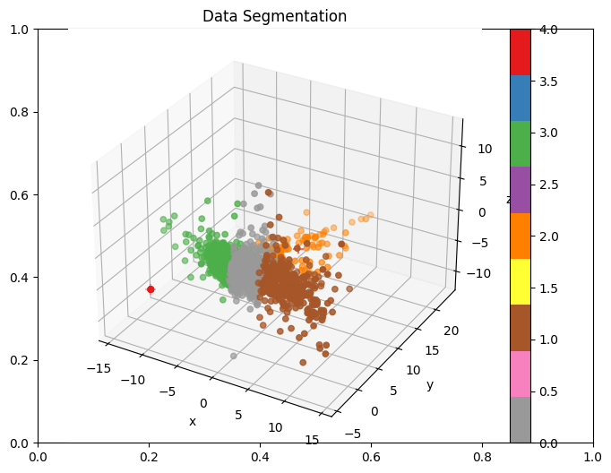
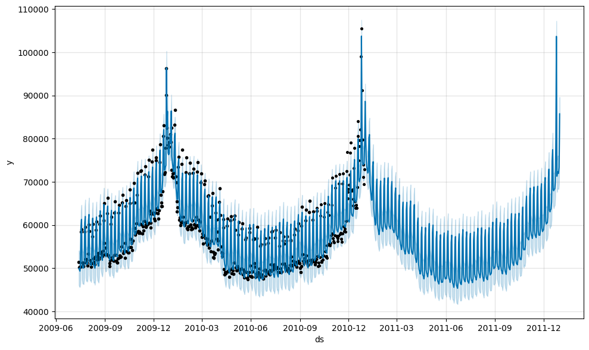
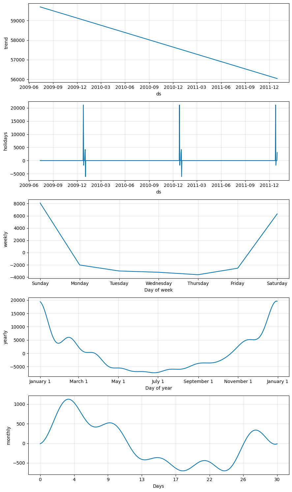

## Time series clustering and forecasting the Customers' electricity usage

### Problem : We are given daily electricity usage data of customers from various residential houses as well as commercial usage and we need to forecast daily usage of each customer

### Here we are leveraging clustering since there are many customers and training a model for each is not scalable and efficient. For forecasting we are using fbprophet

### Dataset overview : 
Dataset contains: The given dataset contains 6445 IDs from ID 1000 to ID 7444. The dataset provide daily electricity usage from July 14, 2009 to December 31, 2010. The costumers are not only from housing but also companys.

### here are some visualization and forecating results:
---

The trend of electricity usage in this cluster is linearly decreasing with the highest usage in January and the lowest in about June. R Squared of this prediction is good 82% and the RMSE is 4439.82.

